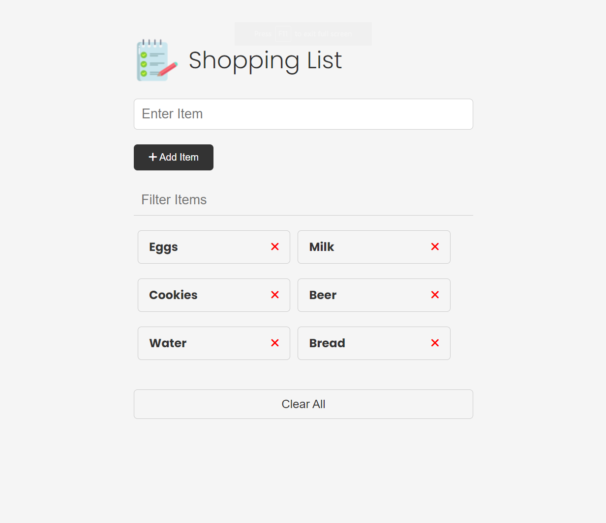

## Shopping List Application

This repository contains a simple shopping list application built with Vanilla JavaScript. It allows users to add, edit, and remove items from the shopping list, as well as filter the items based on a search query.

The code demonstrates the usage of event listeners, DOM manipulation, local storage, and various utility functions to manage the shopping list functionality. It provides a foundation for building a responsive and interactive list management application.

### Key Features:

- Adding items: Users can input new items into the text field and add them to the list by clicking the "Add Item" button.
- Removing items: Users can remove items from the list by clicking the "Remove" button next to each item.
- Updating items: Users can edit existing items by clicking on the item text, which enables the edit mode. They can then modify the item and update it by clicking the "Update Item" button.
- Filtering items: Users can filter the displayed items by entering a search query in the filter input field, which dynamically hides items that do not match the search criteria.
- Persistence: The application stores the added items in the browser's local storage, allowing the list to persist even after page reloads.

### Demo:

Check it out live: [Shopping List App](https://tranquil-yeot-ecca8d.netlify.app)

### Credits

This shopping list application was created as part of the JavaScript Course by Brad Traversy. Brad Traversy is the author and instructor of the course, which provides comprehensive training on JavaScript development.
